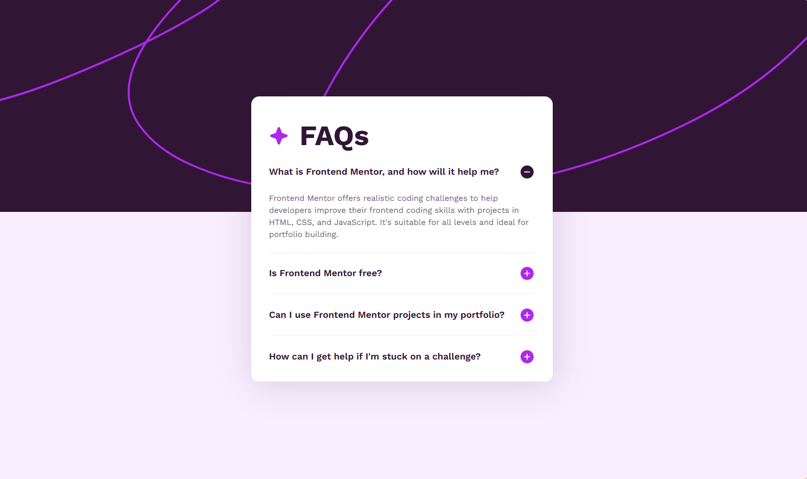
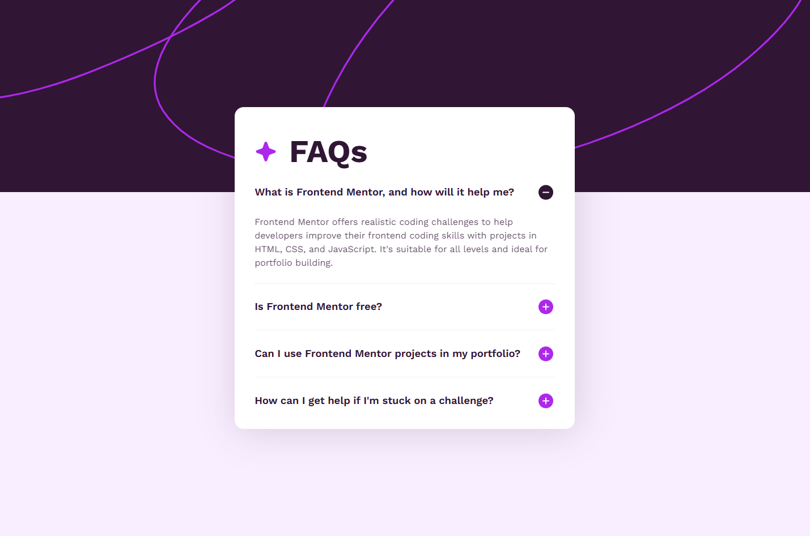
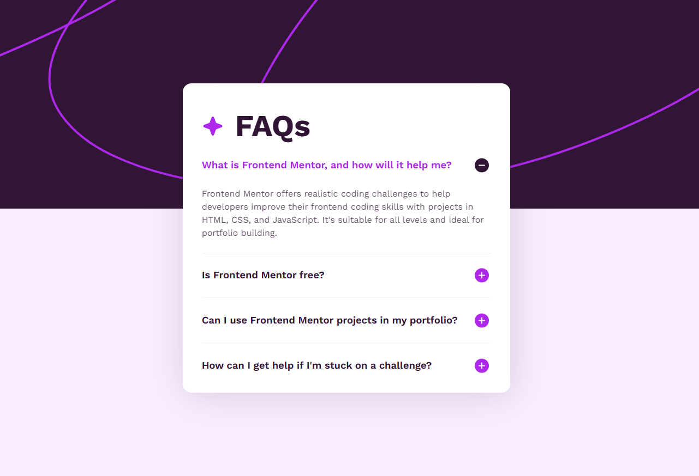
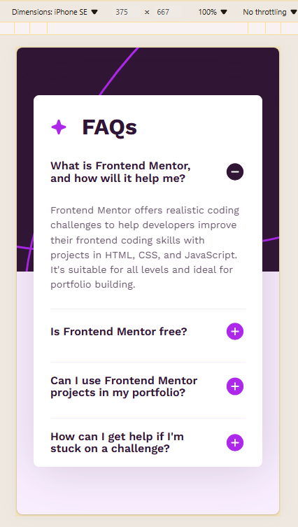

# Frontend Mentor - FAQ accordion solution by Grimm-N
Responsive section with FAQ accordion (HTML, CSS, JS)

This is a solution to the [FAQ accordion challenge on Frontend Mentor](https://www.frontendmentor.io/challenges/faq-accordion-wyfFdeBwBz). Frontend Mentor challenges help you improve your coding skills by building realistic projects. 

## Table of contents

- [Overview](#overview)
  - [The challenge](#the-challenge)
  - [Screenshot](#screenshot)
  - [Links](#links)
- [My process](#my-process)
  - [Built with](#built-with)
  - [What I learned](#what-i-learned)
  - [Continued development](#continued-development)
  - [Useful resources](#useful-resources)
- [Author](#author)

## Overview

### The challenge

Users should be able to:

- Hide/Show the answer to a question when the question is clicked
- Navigate the questions and hide/show answers using keyboard navigation alone
- View the optimal layout for the interface depending on their device's screen size
- See hover and focus states for all interactive elements on the page

### Screenshot

### Links

- Solution URL: [Add solution URL here](https://your-solution-url.com)
- Live Site URL: [Add live site URL here](https://your-live-site-url.com)

## My process

### Built with

- Semantic HTML5 markup
- CSS custom properties
- Flexbox
- JS

### What I learned

Guess who's leveling up in JavaScript? 🙋‍♀️ Yep, that's me! Finally starting to make sense of all that crazy code, and I’m even naming my classes like a BEM boss now. Block, Element, Modifier – feeling like a real dev ninja 🥷💻!

### Continued development

My goal remains the same: to learn how to create perfectly mobile-adapted websites. I'm dedicated to mastering this skill.

### Useful resources

- [A (more) Modern CSS Reset](https://piccalil.li/blog/a-more-modern-css-reset/) - Thanks again to Andy Bell for his wonderful cheat sheet! I'm using it, adapting it to my needs, and I highly recommend it to everyone.

## Author

- Frontend Mentor - [@Grimm-N](https://www.frontendmentor.io/profile/Grimm-N)
- Twitter - [@Grimm__N](https://x.com/Grimm__N)
